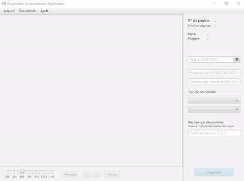

# Tela

# Funções
- Auto deteção da data, protocolo e tipo de documento
- Visualização das páginas do documento
- Total de páginas do documento
- Número da página atual
- Link para página
- Link para visualizar a página no programa padrão do SO
- Zoom nas páginas
- Tipos de documentos organizados de forma a facilitar a escolha
- Classificação de Portarias por número de página
- Formatação inteligente do protocolo e da comunicação interna 
- Visualização rápida das folhas pretas
- Comandos de atalhos do teclado para agilizar o trabalho
- Opção de ver o texto extraído

# Auto detecção
A auto detecção é realizada a partir do segundo documento, pois para que o Regex encontre a data, protocolo e tipo do documento é realizado uma extração do texto da primeira página de cada documento. Para realizar uma auto detecão rápida, foi utilizado thread para que extraia o texto e detecte em segundo plano, assim quando o usuário clicar em organizar, os dados já estarão prontos para serem inseridos nos campos correspondentes.
